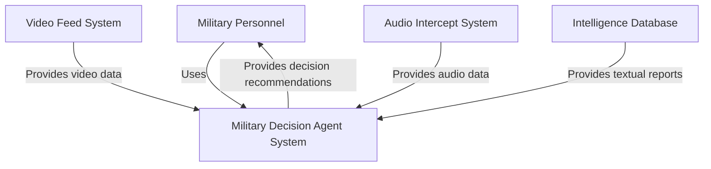
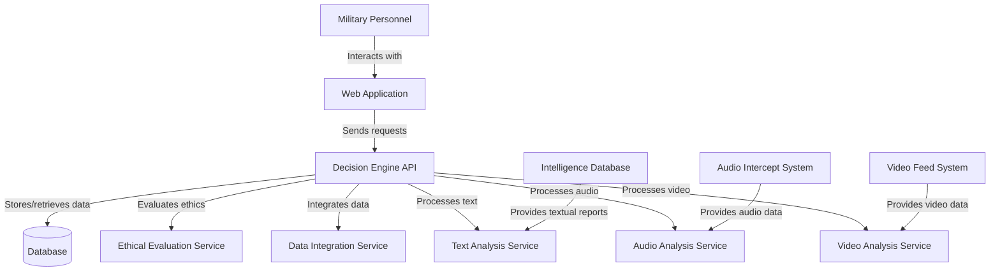
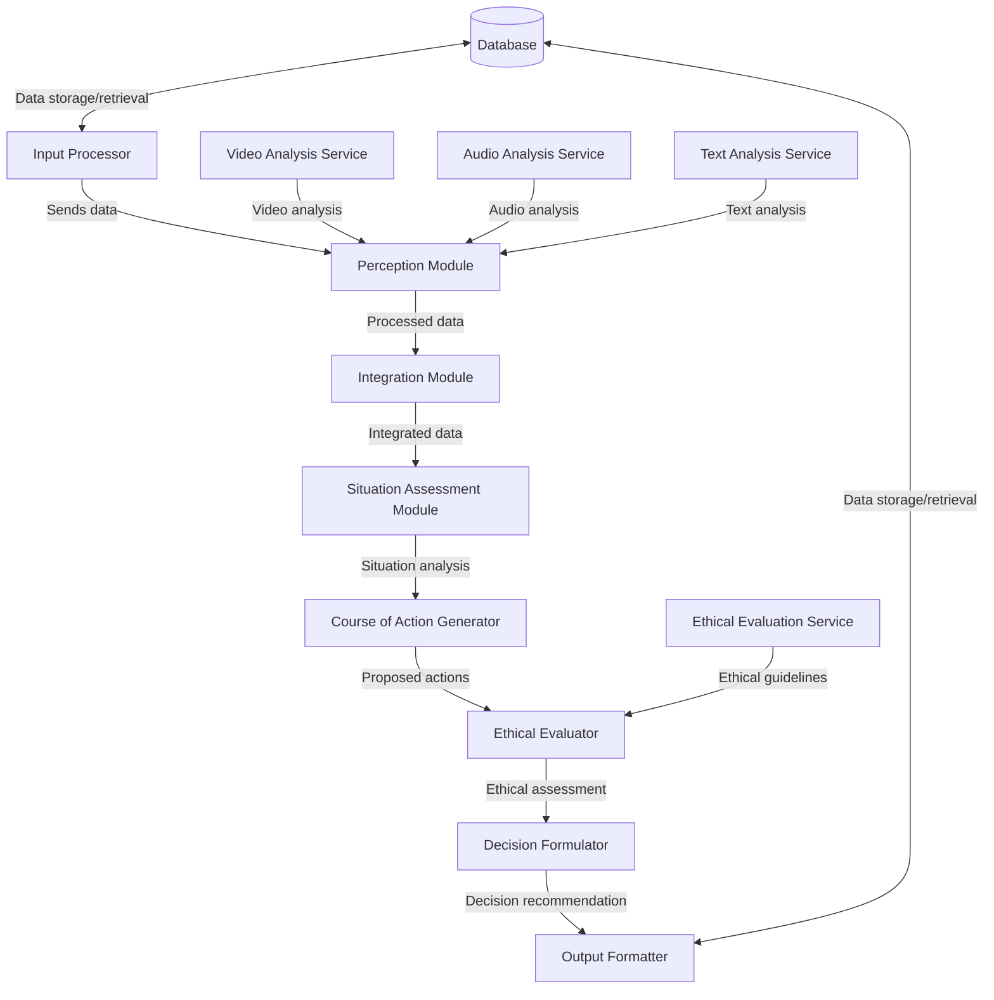

## Level 1: System Context Diagram

This diagram shows the high-level context of the Military Decision Agent System, including its interactions with users (Military Personnel) and external systems (Video Feed System, Audio Intercept System, and Intelligence Database).

## Level 2: Container Diagram

This diagram breaks down the Military Decision Agent System into its main containers, showing how they interact with each other and external systems.

## Level 3: Component Diagram (for Decision Engine API)

This component diagram focuses on the Decision Engine API, showing how different modules within it interact to process inputs and generate decision recommendations.

These diagrams illustrate the growth loop and integration of the Military Decision Agent System, depicting key systems, actors, and relationships at different levels of abstraction.
