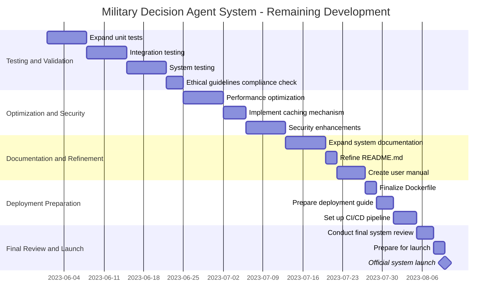

# Military Decision Agent System - Development Plan

---

## Completed Work

1. Project Initialization
2. Core System Architecture Design
3. Implementation of main components:
    - main.py
    - config.py
    - agents.py
    - models.py
    - tools.py
    - utils.py
4. Basic README.md
5. requirements.txt
6. Dockerfile

## Remaining Development Plan

## Timeline and Milestones

This revised plan spans approximately 8 weeks, focusing on refining, testing, and preparing the system for deployment. Key milestones include:

1. Completed testing and validation (End of Week 3)
2. Optimization and security enhancements done (End of Week 5)
3. Documentation and refinement finished (Middle of Week 7)
4. Deployment preparation completed (End of Week 7)
5. Official system launch (End of Week 8)

## Notes

This timeline assumes that the core functionality is already in place and working. The focus is now on ensuring the system is robust, secure, well-documented, and ready for deployment.

The team should review progress regularly and adjust the timeline if necessary. Regular communication and collaboration will be key to meeting these ambitious but achievable goals.
