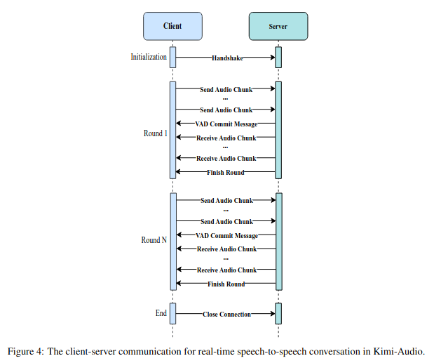

Algo - Kimi Audio

Kimi-Audio is designed to handle various audio-related tasks, such as speech recognition, audio
understanding, audio-to-text chat, and speech-to-speech conversation. We take real-time speech-to-speech conversation as an example to illustrate the practices in Kimi-Audio deployment, since
this task is more complicated than the rest of audio tasks in terms of infrastructure and engineering
efforts. We first introduce the workflow of real-time speech conversation between the client (e.g.,
Kimi APP or web browser) and the server (Kimi-Audio service) and then describe the practices of
product deployment

-  Workflow of Real-Time Speech Conversation
The workflow of a speech-to-speech conversation between the user client (e.g., Kimi APP) and
the server (Kimi-Audio service) is illustrated in Figure - Client-Server Communication.  The workflow proceeds in the following manner for each conversation round:
    - The user speaks to the client (e.g., Kimi APP or web browser), and the audio data is collected
and streamed to the server.
    -  On the server side, a voice activity detection (VAD) module determines if the user has finished
speaking.
    - Once the user stops speaking, the server sends a commit signal and initiates the inference
process of the Kimi-Audio model.
    -  During inference, the client receives audio chunks in real-time as they are generated and starts
playing them for the user.
    -  The client (mobile phone or web browser) plays the received audio chunks back to the user.

 

The inference process of Kimi-Audio on the server side for each round follows these steps. First, the
input audio is converted to discrete semantic tokens and continuous acoustic vectors using the audio
tokenizer. Next, the input to the Audio LLM is assembled by concatenating the system prompt
tokens, audio tokens, and conversation history tokens. The token sequence is then passed to the
Audio LLM, which generates output tokens. Finally, the output tokens are converted back into an
audio waveform using the detokenizer.

- Production Deployment

As shown in Figure - Production Deployment, in a production environment, all core components: Audio Tokenizer, Audio LLM, and Audio Detokenizer, are computationally intensive, requiring a scalable and efficient infrastructure. To address this, we designed the production deployment architecture as follows.

- Kimi-Audio RTC Service. 
    - This service interfaces with the client, receiving audio from the user, forwarding it to the Inference Scheduler, and returning the generated audio chunks to the client. We use the WebRTC protocol to ensure a stable and low-latency connection.

- Inference Scheduler. 
    - The Inference Scheduler manages the conversation flow by maintaining conversation history as tokens in a storage backend. For each interaction round, it performs the following steps:
        - Call the Tokenizer Service to convert the user’s audio into tokens.
        - Construct the model input by combining the new tokens with the conversation history.
        - Send the input to the LLM Service to generate response tokens.
        - Call the Detokenizer Service to convert the response tokens into audio output.

    Additionally, it stores all output tokens as part of the ongoing conversation history to ensure
    continuity in the dialogue.

- Tokenizer/Detokenizer/LLM Services: 
    - These services handle model inference and are equipped with a load balancer and multiple inference instances to handle requests in parallel, ensuring scalability.

This modular architecture ensures that Kimi-Audio can scale effectively to meet the performance
demands of real-time speech interactions while maintaining low latency and high availability in
production.

 
