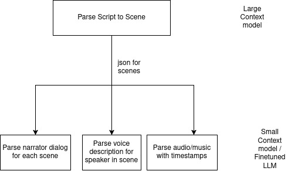

# NotebookLM - Self-hosted Audiobook Generation Platform

  

    
  

  

    
  

## Overview

NotebookLM is a self-hosted platform designed to create, manage, and enhance audiobooks. This platform leverages various tools and models to parse, transcribe, and improve manuscripts, ultimately providing high-quality audio content.

- [Project Dhwani](https://slabstech.com/dhwani/) 
  - [Source] (https://github.com/slabstech/dhwani)

 

- **Roadmap**: Product Launch Roadmap [Read more](docs/roadmap.md)

### Steps 
- python audiobook.py
  - converts script pdf into structured scene json using mistral-large API.  
  - triggers Text to Speech server for speech/dialogs and store audio files in resources folder
  - triggers Text to Sound server for background sound/music and store audio files in resources folder
  - Combines generated audio from speech and sound modules and creates audibook for the provided script

 

- **Prompts for Audiobook**: Creating a storyline using prompts [Read more](docs/prompts.md)

## Current Status

| Module            | Description                                         | Tech                   | Source                   | Status |
|-------------------|------------------------------------------------|------------------------|------------------------|------------------------|
| Script parser     | Convert to scene structured json              |  LLM Multi-shot Prompt                       | [script_parser.py](script_parser.py)                       | Done |
| TTS server        | Parler-tts server to generate speech for dialogs in scenes | Parler-tts             | [tts_generator.py](tts_generator.py)                       | Done |
| AudioGen module   | Audiocraft/magnet background sound creator    | Audiocraft/magnet      |                        | In progress |
| Basic audiobook   | Linear workflow for full audio creation without scene logic | python                       |  [audiobook.py](audiobook.py)                      | In progress |

## Documentation

- **Challenge**: project challenge. [Read more](docs/challenge.md)
- **Approach**: Approach in solving the problem. [Read more](docs/approach-challenge.md)
- **Workflow**: Worflow for audiobook generation. [Read more](docs/workflow.md)
- **Setup**: Follow the [setup guide](docs/setup.md) to build an End-to-End platform for Audibook Generation/Notebook LLM.
- **UX**: UX design for Audiobook generation [Read more](docs/ux.md)
- **Database Schema**: Schema for Scene Editing and Media content [Read more](docs/database_schema.md)

An experiment to build a production grade audiobook content generator system to help publishers build on their IP and reach larger audience.

## Inference Speed

| GPU Model    | `torch.compile` |  Speech Generator (secs)  | Script Parser (Local) (secs) | Script Parser (Online) (secs) | Total Time (secs) |
|--------------|------------------|---------------------------|-------------------|--------------------|--------------------|
| GTX 1060     | no               | 2775.97                   | -                 | 87.37              | 2863.34            |
| RTX 4050     | no               | 489.93                    | -                 | 93.82              | 583.75             |
| RTX 4050     | yes              | --                        | -                 | --                 | --                 |

## Reference

- **NotebookLlama**: Additional resources and use cases. [Learn more](https://github.com/meta-llama/llama-cookbook/tree/main/end-to-end-use-cases/NotebookLlama)

- TTS - Generation Docker - https://github.com/ashleykleynhans/tts-generation-docker
- https://github.com/rsxdalv/tts-generation-webui
- WishList - RTX 4090 GPU based computer for building End to End product inhouse. Buy Me [Razer Blade 18](https://www.notebooksbilliger.de/razer+blade+18+mercury+848789) or [ROG Zephyrus M16 ](https://www.notebooksbilliger.de/rog+zephyrus+m16+gu604vy+nm042w+847870)

- Specific Speakers - Jon, Lea, Gary, Jenna, Mike, Laura

- Inference Tips
  - [Inference Upgrade](https://github.com/huggingface/parler-tts/blob/main/INFERENCE.md)
  - [Large Token Generation](https://huggingface.co/spaces/ai4bharat/indic-parler-tts/blob/main/app.py#L179)