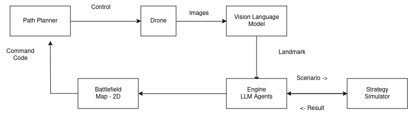

Drishti - Reconaissance

Use Drones to create real-time insights of battlefield. Tactical use in confined spaces to identify enemy logistics.

We use Open source code, Open Weight LLM/VLM modls to obtain additional info using the images.

Create 2D map, identify the resources.

 

- Strategy 1  
    - Kamikaze drone with on device reconnaissance. 
    - Idea
        - Make  observations,  gather info, generate insights  and then send data back. 
        - Breaking radio silence.
        - Clean up / wipe device once data is done.
        - No data left behind in drones. self destruct/ over clocking/ short circuit. 

- Strategy 2
    - Low cost drone with server 
    - Idea
        - Process images from drone on server. 
        - Send command and instructions back via agent 
        - Make entire option Autonomous. 
        - How to build safeguard,  
        - Obstacle avoidance,  human recognition. 
        - Return to home. 

- Hardware 
    - Quadcoptor - [Ryze Tello EDU](https://www.ryzerobotics.com/tello-edu/specs)
    - Server - ThinkPad p1

- Tasks for Hackathon 
    - Task 1 - drone control
        - Hover up, take 360 turn and video capture.
        - Hover down.  Send the video to server
        - Repeat every x / 10 mins

    - Task 2 - Video processing 
        - Take input video  
        - Process into frames/ images 
        - Stitch images, process images via vision recognition models. 
        - Store metadata into a file .

    - Task 3 - Meta data processing 
        - Fuse the metadata, remove duplicate identifier. 
        - Use an llm to generate additonal insights.

    -  Task 4 - Speech Interaction  - Analyst / User
        - Ask voice queries to gather more information From the data. 
        - Create additonal commands to drone for navigation.  Search a different area, return to base, repeat the search with different camera angle. 

    - Task 5 - Drone control program
        - Build Autonomous capacity for the drone to take dynamic commands . Update firmware with new code .
        - Codestral for code generation / use in Fill in Middle . For Navigatio commands
        - Generate code for robot navigation
        - Test changes in Docker environments

    - Task 6 - Strategy Simulator 
        - Autogen agent built with different prompt for Roles 
            - Explainer / Strategy Creator = Mixtral 8x22b
            - Analyst - Mistral 8x7b
            - Edge Device - Mistral 7b

        - Trial capture the flag with different llm models. 
        - Puzzles for encryption or secret passing on unencrypted  amatuer radio. 

    - Task 7 - LLM Agent Setup
        - Radio Operator
        - Logistics
        - Food
        - Doctor 
        -
        - How does it respond to different scenarios .

--- 

= Setup
    = sudo tailscale up
    = curl -fsSL https://tailscale.com/install.sh | sh
    = ssh abcd@abcd.com 

--

Connect the dots

Slow down,  notev every step. 

You'll find the problem,  trace the project from start to end. 

Make hand made diagrams,  no substitute for deep learning

--

- Reference
    - Tello SDK = https://github.com/cocpy/Tello-Python/blob/master/tello/tello.py
    - DJI - Tello SDK - https://github.com/dji-sdk/Tello-Python
    - Multiple Swarm - https://github.com/TelloSDK/Multi-Tello-Formation
    - https://www.instructables.com/Tello-Drone-Python-Programming-Control-Drone-With-/
    - https://pypi.org/project/djitellopy/
    - https://djitellopy.readthedocs.io/en/latest/
    - https://github.com/damiafuentes/DJITelloPy

    - jupyter nbconvert --to slides --no-input presentation.ipynb