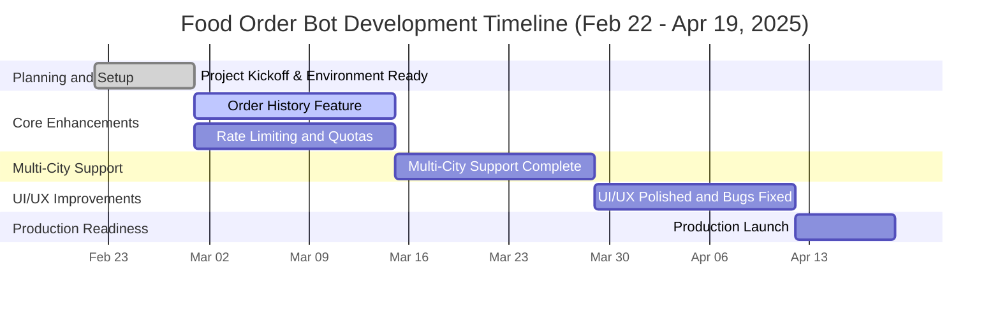

# Project Plan: Food Order Bot Enhancements and Production Readiness

## Startup Team: 4 Engineers (Frontend, Backend, LLM/AI, DevOps/Testing)

## Duration: 8 Weeks (February 22, 2025 – April 19, 2025)

## Objective:
Enhance the Food Order Bot, resolve known issues, and prepare for a production launch.

## Assumptions:

- Engineers work 40 hours/week, with a 20% buffer for unforeseen issues.
- Each engineer focuses on their expertise but collaborates on critical tasks.
- Access to necessary tools (Git, Python, Mistral API, Gradio, FastAPI) and hardware.
- Weekly syncs (1 hour) for planning and progress tracking.

## Goals:

- **Ambitious but Realistic:** Launch a production-ready Food Order Bot with multi-city support, rate limiting, order history, and improved UI/UX within 8 weeks.
- **Clear and Achievable:** Each milestone builds on the previous, ensuring steady progress and quality.

## Detailed Plan

### Week 1: Planning and Setup (February 22 – February 28, 2025)

#### Deliverables:

- Finalize project scope and requirements document (based on Spec 4).
- Set up development environment, version control (Git), CI/CD pipeline (GitHub Actions).
- Update `requirements.txt` and ensure all dependencies are installed.
- Conduct initial code review and refactor for clarity.

#### Milestone:

- **Project Kickoff and Environment Ready**

#### Engineer Roles:

- **All Engineers:** Collaborate on planning and setup (8 hours each).
- **DevOps/Testing:** Set up CI/CD pipeline (16 hours).

#### Timeline:

- February 22–28 (1 week)

### Week 2–3: Core Enhancements (March 1 – March 14, 2025)

#### Deliverables:

- **Order History Feature:**
  - Backend: Add `/orders/history` endpoint in `mock_server.py` and `db.py` for retrieving past orders.
  - Frontend: Implement Gradio command to show order history in `gradio_client.py`.
- **Rate Limiting and Quotas:**
  - Backend: Implement rate limiting using `fastapi-limiter` or custom middleware in `mock_server.py` (e.g., 100 requests/hour per user).
  - Testing: Unit tests for rate limiting and order history.

#### Milestone:

- **Core Features Implemented**

#### Engineer Roles:

- **Backend Engineer:** Order history endpoint and rate limiting (40 hours total over 2 weeks).
- **Frontend Engineer:** Gradio UI updates (30 hours total over 2 weeks).
- **LLM/AI Engineer:** Review LLM tool calls for order history compatibility (20 hours total over 2 weeks).
- **DevOps/Testing:** Write tests and set up CI/CD for new features (40 hours total over 2 weeks).

#### Timeline:

- March 1–14 (2 weeks)

### Week 4–5: Multi-City Support and Data Expansion (March 15 – March 28, 2025)

#### Deliverables:

- **Multi-City Support:**
  - Update `restaurants.json` to include "city" for each restaurant (e.g., New York, Los Angeles, Bengaluru).
  - Enhance `order_processor.py` and `llm.py` to filter restaurants by city dynamically.
- **Data Expansion:**
  - Add sample restaurant data for other cities (e.g., 5 restaurants per city).
  - Update `filter_restaurants_by_city` in `order_processor.py` to handle multi-city logic.

#### Milestone:

- **Multi-City Support Complete**

#### Engineer Roles:

- **Backend Engineer:** Update `db.py` and `order_processor.py` for multi-city (40 hours total over 2 weeks).
- **LLM/AI Engineer:** Refine `llm.py` tools for city-specific queries (30 hours total over 2 weeks).
- **Frontend Engineer:** Update Gradio to display city selection (20 hours total over 2 weeks).
- **DevOps/Testing:** Test multi-city logic and data integrity (40 hours total over 2 weeks).

#### Timeline:

- March 15–28 (2 weeks)

### Week 6–7: UI/UX Improvements and Bug Fixes (March 29 – April 11, 2025)

#### Deliverables:

- **Gradio Formatting Fix:**
  - Resolve `\n` rendering issue in `gradio_client.py` using HTML or split-line approach.
  - Ensure line breaks appear correctly for menu, order summary, etc.
- **Bug Fixes:**
  - Address any remaining tool call issues (e.g., price filtering in Rs).
  - Fix any performance or stability issues identified during testing.

#### Milestone:

- **UI/UX Polished and Bugs Fixed**

#### Engineer Roles:

- **Frontend Engineer:** Gradio formatting fix (40 hours total over 2 weeks).
- **Backend Engineer:** Bug fixes in `mock_server.py` and `order_processor.py` (30 hours total over 2 weeks).
- **LLM/AI Engineer:** Adjust `llm.py` for price filtering (20 hours total over 2 weeks).
- **DevOps/Testing:** Comprehensive testing and performance tuning (40 hours total over 2 weeks).

#### Timeline:

- March 29–April 11 (2 weeks)

### Week 8: Production Readiness and Deployment (April 12 – April 19, 2025)

#### Deliverables:

- **Production Deployment:**
  - Deploy FastAPI server to a cloud provider (e.g., AWS, GCP) with Docker.
  - Configure Gradio for public access with `share=True`.
- **Documentation Update:**
  - Update Spec 4 and add user manuals, API docs (OpenAPI/Swagger).
- **Final Testing and Launch:**
  - Conduct end-to-end testing with real users.
  - Launch the Food Order Bot publicly.

#### Milestone:

- **Production Launch**

#### Engineer Roles:

- **DevOps/Testing:** Deployment and final testing (40 hours total over 1 week).
- **Backend Engineer:** Dockerize and configure server (30 hours total over 1 week).
- **Frontend Engineer:** Public Gradio setup (20 hours total over 1 week).
- **LLM/AI Engineer:** Final LLM tuning (10 hours total over 1 week).

#### Timeline:

- April 12–19 (1 week)

## Mermaid Gantt Chart

Below is a Mermaid Gantt chart representing the timeline and milestones. You can paste this into a Markdown viewer or Mermaid live editor (e.g., Mermaid Live Editor) to visualize it.

## Key Milestones and Deadlines:

- **February 28, 2025:** Project Kickoff and Environment Ready – All tools, repositories, and environments set up.
- **March 14, 2025:** Core Features Implemented – Order history and rate limiting complete.
- **March 28, 2025:** Multi-City Support Complete – Multi-city functionality and data expansion finalized.
- **April 11, 2025:** UI/UX Polished and Bugs Fixed – Gradio formatting fixed, bugs resolved.
- **April 19, 2025:** Production Launch – System deployed to production, tested, and launched publicly.

## Engineer Allocation and Collaboration:

- **Week 1:** All engineers collaborate on planning (20% of time), with DevOps/Testing leading CI/CD setup.
- **Weeks 2–7:** Engineers focus on their specialties but pair for cross-functional tasks (e.g., Backend/LLM for tool calls, Frontend/DevOps for testing).
- **Week 8:** DevOps/Testing leads deployment, with all engineers contributing to final testing and documentation.

## Ambitious but Realistic Goals:

- **Launch a Production-Ready Product:** Deploy a scalable, user-friendly Food Order Bot within 8 weeks, supporting multi-city operations and advanced features.
- **Maintain Code Quality:** Achieve 100% linting compliance and consistent formatting, with automated testing covering 80% of functionality.
- **User Experience:** Ensure 95% of user queries (e.g., login, ordering, city filtering) are handled correctly via LLM tool calls.
- **Scalability:** Handle 1,000 concurrent users with rate limiting and SQLite optimization.

## Notes:

- **Risks:** Delays in LLM API response times, Gradio UI issues, or third-party API downtime could push timelines. Buffer 20% extra time for each milestone.
- **Tools:** Use Git for version control, Slack for communication, and Jira/Trello for task tracking.
- **Testing:** Weekly integration tests by DevOps/Testing, with final user testing in Week 8.

---
